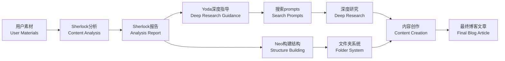

# Agents4Blog - 个人博客写作助手 | Personal Blog Writing Assistant

一个基于智能Agent的博客写作助手系统，帮助用户基于已有资料高效创作优质博客文章。系统集成了内容分析、结构生成和写作辅助等核心功能。

An intelligent Agent-based blog writing assistant system that helps users efficiently create high-quality blog articles based on existing materials. The system integrates content analysis, structure generation, and writing assistance capabilities.

## 🤖 系统 Agent 架构 | System Agent Architecture

### 🕵️ Sherlock - 内容分类分析Agent | Content Categorization Analysis Agent
**角色设定 | Role Setting:** 侦探大师，擅长分析内容主题和分类 | Master Detective, specializing in content analysis and categorization

- 分析现有资料和想法文件（如`ideas.md`）| Analyze existing materials and idea files (e.g., `ideas.md`)
- 自动识别和分类内容主题 | Automatically identify and categorize content topics
- 生成结构化的内容创作计划 | Generate structured content creation plans
- 基于目标受众和优先级进行主题排序 | Prioritize topics based on target audience and importance

**输出报告 | Output Reports:**
- `Sherlock_YYYYMMDD_HHMM.md` - 详细的分类分析报告 | Detailed categorization analysis reports
- 每个主题的核心要点、目标字数、发布优先级 | Key points, target word count, and publication priority for each topic
- 分阶段的创作计划建议 | Phased content creation recommendations

### 🥋 Neo - 结构生成Agent | Structure Generation Agent
**角色设定 | Role Setting:** 天选之人，能看到内容的矩阵 | The Chosen One, can see the matrix of content

- 基于Sherlock分析结果创建文件夹结构 | Create folder structures based on Sherlock analysis results
- 为每个内容类别生成README.md文档 | Generate README.md documentation for each content category
- 创建想法池文件(ideas_pool.md)用于持续收集灵感 | Create ideas pool files (ideas_pool.md) for continuous inspiration collection
- 建立内容模板和索引系统 | Establish content templates and indexing systems

### 🧙‍♂️ Yoda - 深度研究顾问Agent | Deep Research Advisor Agent
**角色设定 | Role Setting:** 智慧的绝地大师，提供深度研究指导 | Wise Jedi Master, providing deep research guidance

- 分析Sherlock报告识别深度研究机会 | Analyze Sherlock reports to identify deep research opportunities
- 生成精简的研究简报和搜索提示 | Generate concise research briefs with search prompts
- 评估主题的研究价值和可行性 | Evaluate research value and feasibility of topics
- 提供系统性的深度学习路径建议 | Provide systematic deep learning path recommendations

**输出报告 | Output Reports:**
- `Yoda_YYYYMMDD_HHMM.md` - 深度研究机会分析报告 | Deep research opportunity analysis reports
- 每个主题的精准搜索prompts和资源推荐 | Precise search prompts and resource recommendations for each topic

**Neo自动创建的结构 | Structure Automatically Created by Neo:**
```
[Category_Folder_Name]/
├── README.md                 # 类别概述和写作指南 | Category overview and writing guide
├── ideas_pool.md            # 持续的想法收集池 | Continuous idea collection pool
├── templates/               # 内容模板（可选）| Content templates (optional)
├── published/               # 已发布文章（可选）| Published articles (optional)
└── drafts/                  # 草稿文章（可选）| Draft articles (optional)
```

## 🎯 核心功能特点 | Core Features

### 智能内容分析 | Intelligent Content Analysis
- **Sherlock侦探式分析 | Sherlock-style Analysis**: 基于内容主题智能归类 | Smart classification based on content themes
- **优先级排序 | Priority Sorting**: 根据时效性和重要性排序 | Organize by timeliness and importance
- **受众识别 | Audience Identification**: 精确定位目标读者群体 | Precise target reader group identification
- **创作规划 | Content Planning**: 提供分阶段的内容创作计划 | Provide phased content creation plans
- **Yoda深度洞察 | Yoda's Deep Insights**: 识别具有深度研究价值的高潜力主题 | Identify high-potential topics with deep research value

### 结构化内容管理 | Structured Content Management
- **Neo矩阵构建 | Neo's Matrix Building**: 自动创建清晰的文件夹结构 | Automatically create clear folder structures
- **文档生成 | Documentation Generation**: 每个类别配备详细的README指南 | Detailed README guides for each category
- **模板系统 | Template System**: 提供标准化的内容创作模板 | Standardized content creation templates
- **持续优化 | Continuous Optimization**: 支持想法池的持续更新和整理 | Support ongoing updates and organization of idea pools

### 深度研究支持 | Deep Research Support
- **智能主题识别 | Smart Topic Identification**: Yoda识别值得深入研究的主题 | Yoda identifies topics worthy of deep research
- **精准搜索提示 | Precise Search Prompts**: 为每个主题提供5个具体搜索方向 | 5 specific search directions for each topic
- **研究路径规划 | Research Path Planning**: 提供系统性的深度学习建议 | Systematic deep learning recommendations
- **资源推荐 | Resource Recommendations**: 学术、实践和社区资源指引 | Academic, practical, and community resource guidance

### 中文本地化支持 | Chinese Localization Support
- **语言适配 | Language Adaptation**: 完全支持中文内容分析和生成 | Full support for Chinese content analysis and generation
- **分类体系 | Categorization System**: 基于中文内容特点的分类系统 | Classification system based on Chinese content characteristics
- **写作指南 | Writing Guidelines**: 针对中文博客的写作规范和建议 | Blog writing standards and suggestions for Chinese content

## 🚀 使用流程 | Usage Workflow

1. **提供素材 | Provide Materials**: 用户上传/输入相关资料和观点 | Users upload/input relevant materials and viewpoints
2. **Sherlock分析 | Sherlock Analysis**: 🕵️ 侦探分析，智能分类和优先级排序 | Detective analyzes, intelligently categorizes and prioritizes
3. **Neo构建 | Neo Construction**: 🥋 矩阵构建，创建文件夹结构和文档 | Matrix builder creates folder structures and documentation
4. **Yoda指导 | Yoda Guidance**: 🧙‍♂️ 大师指导，识别深度研究机会并生成搜索prompts | Master guidance identifies deep research opportunities and generates search prompts
5. **深度研究 | Deep Research**: 基于Yoda的建议进行针对性深度学习 | Targeted deep learning based on Yoda's recommendations
6. **内容创作 | Content Creation**: 基于研究成果创作高质量博客内容 | Create high-quality blog content based on research findings
7. **迭代优化 | Iterative Optimization**: 基于用户反馈修改和完善文章 | Refine and improve articles based on user feedback

## 📋 系统特点 | System Characteristics

- **用户主导 | User-Driven**: 以用户提供的资料和观点为核心 | Centered on user-provided materials and viewpoints
- **灵活可控 | Flexible & Controllable**: 用户可以随时介入和调整创作方向 | Users can intervene and adjust creative direction at any time
- **轻量高效 | Lightweight & Efficient**: 专注核心功能，避免过度复杂化 | Focus on core functions, avoiding over-complexity
- **风格定制 | Style Customization**: 支持个性化的写作风格和表达方式 | Support for personalized writing styles and expressions

## 🛠️ 技术架构 | Technical Architecture

```
用户输入 → Sherlock分析 → Neo构建 → Yoda指导 → 深度研究 → 内容创作 → 最终文章
User Input → Sherlock Analysis → Neo Construction → Yoda Guidance → Deep Research → Content Creation → Final Article
```

### Agent协作流程 | Agent Collaboration Workflow



## 📦 快速开始 | Quick Start

```bash
# 安装依赖 | Install dependencies
pip install -r requirements.txt

# 配置API密钥 | Configure API key
export OPENAI_API_KEY="your-key"

# 启动系统 | Start system
python app.py
```

## 💡 使用示例 | Usage Example

```
用户 | User: 我要写一篇关于远程工作效率的文章 | I want to write an article about remote work productivity
      主要观点：1) 时间管理更重要 2) 沟通工具选择关键 3) 工作环境设置 | Main points: 1) Time management is more important 2) Communication tool selection is key 3) Work environment setup
      角度：支持远程工作，面向企业管理者 | Angle: Support remote work, targeting enterprise managers
      风格：数据驱动，专业说服力 | Style: Data-driven, professional persuasion

系统流程 | System Workflow:
🕵️ Sherlock: [分析用户输入，识别主题分类和优先级 | Analyze user input, identify topic categories and priorities]
📄 Sherlock报告: [生成内容分析报告，建议创作计划 | Generate content analysis report, suggest creation plan]
🥋 Neo: [基于报告创建"远程工作"文件夹结构 | Create "Remote Work" folder structure based on report]
🧙‍♂️ Yoda: [识别深度研究机会，生成搜索prompts | Identify deep research opportunities, generate search prompts]
   - "remote work productivity statistics 2024"
   - "effective time management techniques for remote teams"
   - "best communication tools for distributed teams comparison"
   - "ergonomic home office setup research"
   - "case studies successful remote work implementation"
🔍 深度研究: [基于prompts进行针对性资料收集 | Targeted material collection based on prompts]
✍️ 内容创作: [基于研究成果创作高质量文章 | Create high-quality article based on research findings]
```

---

**专注内容，让创作更简单 | Focus on content, make creation simpler** ✨
